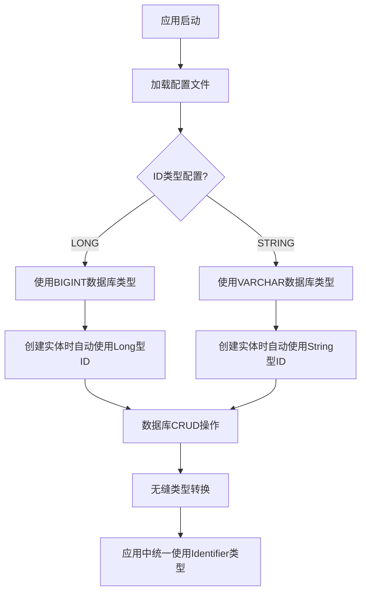
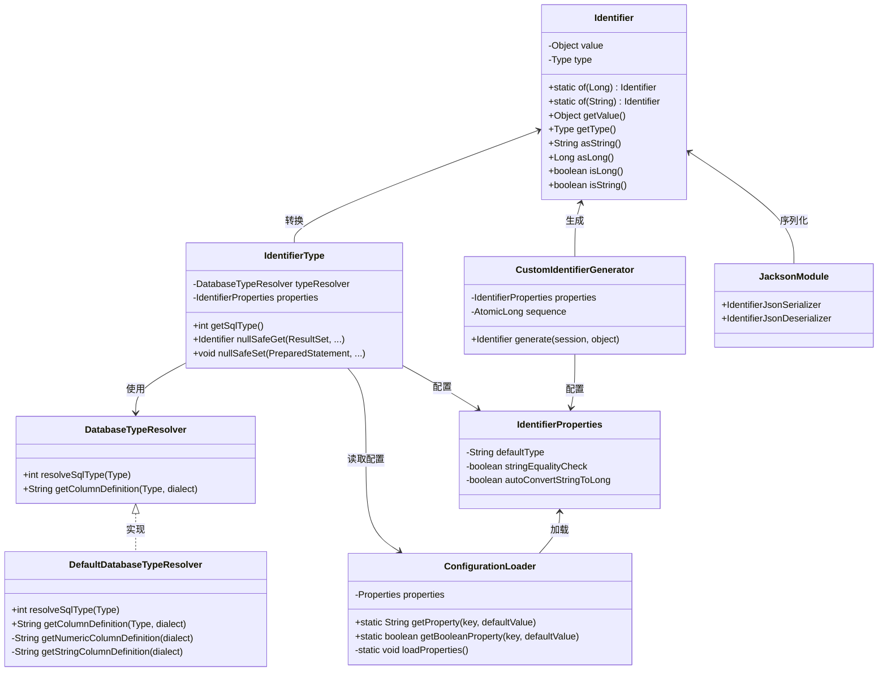
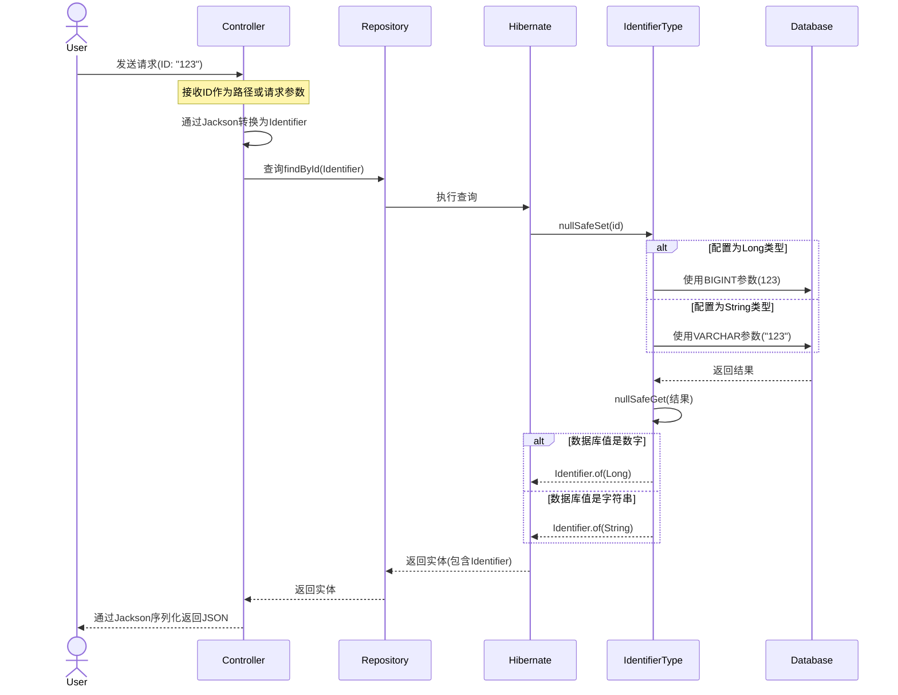

# Architecture for Hibernate Custom ID Type Demo

Status: Updated

## Technical Summary

这个架构方案实现了一个名为"Identifier"的自定义Hibernate ID类型，它能够在运行时根据配置适配不同的底层类型(Long或String)。该实现利用Hibernate的类型系统和Spring Boot的自动配置功能，提供与Spring Data JPA存储库和不同数据库方言的无缝集成。

## 自定义ID类型的核心优势

1. **统一的ID处理方式**：提供单一的`Identifier`类型，统一处理Long和String类型的ID
2. **运行时可配置**：通过配置文件动态切换底层ID类型（Long或String），无需代码修改
3. **类型安全**：提供类型安全的转换方法和严格的类型检查
4. **跨数据库兼容**：自动适配不同数据库方言的ID字段定义
5. **高效存储**：根据配置使用最适合的原生数据库类型(BIGINT或VARCHAR)
6. **对象不可变性**：`Identifier`类设计为不可变对象，确保线程安全
7. **JSON序列化支持**：自定义Jackson序列化/反序列化，确保REST API的一致性
8. **无侵入式集成**：与Spring Data JPA完全兼容，可以直接用作ID类型

## Technology Table

| Technology | Version | Description |
| ------------ | ------- | ------------------------------------------------------------- |
| Java | 17 | Base programming language |
| Spring Boot | 3.2.x | Application framework |
| Hibernate | 6.4.x | ORM framework |
| Spring Data JPA | 3.2.x | Data access abstraction |
| Jackson | 2.15.x | JSON serialization/deserialization |
| H2 Database | 2.2.x | In-memory database for testing |
| MySQL | 8.0.x | Production database option |
| PostgreSQL | 15.x | Production database option |
| JUnit 5 | 5.10.x | Testing framework |
| Lombok | 1.18.x | Boilerplate code reduction |
| Maven | 3.9.x | Build tool |

## 系统工作原理

### 自定义ID类型的工作流程



### 自定义ID类型的详细架构



### 数据流转换过程



## 关键组件详解

### 1. Identifier 类

核心的标识符类，可以同时表示Long或String类型的ID值。

```java
public final class Identifier implements Serializable {
    private final Object value;   // 实际存储的值（Long或String）
    private final Type type;      // 标识符类型枚举
    
    public enum Type {
        LONG, STRING
    }
    
    // 工厂方法：创建Long类型标识符
    public static Identifier of(Long value) {
        return new Identifier(value, Type.LONG);
    }
    
    // 工厂方法：创建String类型标识符
    public static Identifier of(String value) {
        // 可根据配置尝试自动将String转为Long
        if (properties != null && properties.isAutoConvertStringToLong()) {
            try {
                Long longValue = Long.parseLong(value);
                return new Identifier(longValue, Type.LONG);
            } catch (NumberFormatException e) {
                // 转换失败则使用String
            }
        }
        return new Identifier(value, Type.STRING);
    }
    
    // 获取String表示，适用于所有类型
    public String asString() {
        return value.toString();
    }
    
    // 尝试获取Long表示，对于String类型尝试解析
    public Long asLong() {
        if (type == Type.LONG) {
            return (Long) value;
        }
        return Long.parseLong((String) value);
    }
    
    // 类型检查方法
    public boolean isLong() { return type == Type.LONG; }
    public boolean isString() { return type == Type.STRING; }
}
```

### 2. IdentifierType 类

实现Hibernate的UserType接口，处理Identifier与数据库之间的转换。

```java
@Component
public class IdentifierType implements UserType<Identifier> {
    // 根据配置决定使用的SQL类型
    @Override
    public int getSqlType() {
        if (isUseNativeTypes()) {
            Identifier.Type idType = Identifier.Type.valueOf(getIdentifierProperties().getDefaultType());
            return getDatabaseTypeResolver().resolveSqlType(idType);
        }
        return Types.VARCHAR; // 兜底使用VARCHAR
    }
    
    // 从数据库读取值并转换为Identifier
    @Override
    public Identifier nullSafeGet(ResultSet rs, int position, SharedSessionContractImplementor session, Object owner) 
            throws SQLException {
        // 根据配置决定如何读取数据
        if (isLongTypeSystem() && isUseNativeTypes()) {
            Long longValue = rs.getLong(position);
            if (!rs.wasNull()) {
                return Identifier.of(longValue);
            }
        } else {
            String value = rs.getString(position);
            if (value != null) {
                // 尝试解析为Long
                try {
                    return Identifier.of(Long.valueOf(value));
                } catch (NumberFormatException e) {
                    return Identifier.of(value);
                }
            }
        }
        return null; // 处理NULL值
    }
    
    // 将Identifier写入数据库
    @Override
    public void nullSafeSet(PreparedStatement st, Identifier value, int index, SharedSessionContractImplementor session) 
            throws SQLException {
        if (value == null) {
            st.setNull(index, getSqlType());
            return;
        }
        
        // 根据配置和值的类型决定如何写入
        if (isLongTypeSystem() && isUseNativeTypes() && value.isLong()) {
            st.setLong(index, value.asLong());
        } else if (isStringTypeSystem() && isUseNativeTypes() && value.isString()) {
            st.setString(index, value.asString());
        } else {
            st.setString(index, value.asString());
        }
    }
}
```

### 3. DatabaseTypeResolver 接口

处理不同数据库方言的类型映射。

```java
public interface DatabaseTypeResolver {
    // 解析SQL类型代码
    int resolveSqlType(Identifier.Type type);
    
    // 获取特定数据库方言的列定义
    String getColumnDefinition(Identifier.Type type, String dialect);
}
```

### 4. 配置系统

#### ConfigurationLoader

从多种位置加载配置的工具类：

```java
public class ConfigurationLoader {
    // 配置文件的可能位置
    private static final String[] CONFIG_LOCATIONS = {
            "classpath:application.properties",
            "classpath:application.yml",
            "classpath:application-${spring.profiles.active}.properties",
            "file:./application.properties",
            "file:./config/application.properties"
    };
    
    // 获取属性值
    public static String getProperty(String key, String defaultValue) {
        ensurePropertiesLoaded();
        return properties.getProperty(key, defaultValue);
    }
    
    // 加载配置文件
    private static synchronized void loadProperties() {
        // 从多个位置尝试加载配置
        // 支持类路径和文件系统加载
        // 支持不同环境的配置文件
    }
}
```

#### IdentifierProperties

存储Identifier相关配置的类：

```java
@Configuration
@ConfigurationProperties(prefix = "identifier")
public class IdentifierProperties {
    private String defaultType = "LONG";
    private boolean stringEqualityCheck = true;
    private boolean autoConvertStringToLong = true;
    
    // getters and setters
}
```

### 5. ID生成器

自定义ID生成策略，根据配置生成适当类型的ID：

```java
@Component
public class CustomIdentifierGenerator implements IdentifierGenerator {
    private final IdentifierProperties identifierProperties;
    private final AtomicLong sequence = new AtomicLong(1);
    
    @Override
    public Identifier generate(SharedSessionContractImplementor session, Object object) {
        // 如果实体已有ID，则使用现有ID
        if (object instanceof Person person && person.getId() != null) {
            return person.getId();
        }
        
        // 根据配置生成不同类型的ID
        if ("LONG".equals(identifierProperties.getDefaultType())) {
            return Identifier.of(sequence.getAndIncrement());
        }
        
        return Identifier.of(UUID.randomUUID().toString());
    }
}
```

## 数据库支持

### 数据库类型映射

| 配置的ID类型 | MySQL     | PostgreSQL | H2        | 特点                        |
|-----------|-----------|------------|-----------|----------------------------|
| LONG      | BIGINT    | BIGINT     | BIGINT    | 数值类型，空间效率高，适合大规模数据    |
| STRING    | VARCHAR   | VARCHAR    | VARCHAR   | 字符串类型，灵活支持各种格式的ID      |

## 使用示例

### 实体定义

```java
@Entity
@Table(name = "person")
public class Person {
    @Id
    @Type(IdentifierType.class)
    @Column(name = "id")
    @GeneratedValue(generator = "custom-identifier")
    @GenericGenerator(name = "custom-identifier", 
                     strategy = "com.example.idtypedemo.type.CustomIdentifierGenerator")
    private Identifier id;
    
    // 其他字段和方法
}
```

### 配置属性

在`application.properties`中配置ID类型：

```properties
# 使用Long类型作为ID（默认）
identifier.default-type=LONG
identifier.string-equality-check=true
identifier.auto-convert-string-to-long=true

# 或者使用String类型作为ID
# identifier.default-type=STRING
```

### 仓库接口

```java
public interface PersonRepository extends JpaRepository<Person, Identifier> {
    // 无需特殊处理，可直接使用Identifier作为ID类型
}
```

## 结语

这个自定义Identifier类型解决方案提供了灵活且强大的ID类型管理机制，特别适合需要在不同部署环境中切换ID类型的系统，或者需要同时支持数值型和字符串型ID的场景。方案的核心优势在于提供统一的API接口，同时保持底层数据库存储的类型安全和性能优化。 