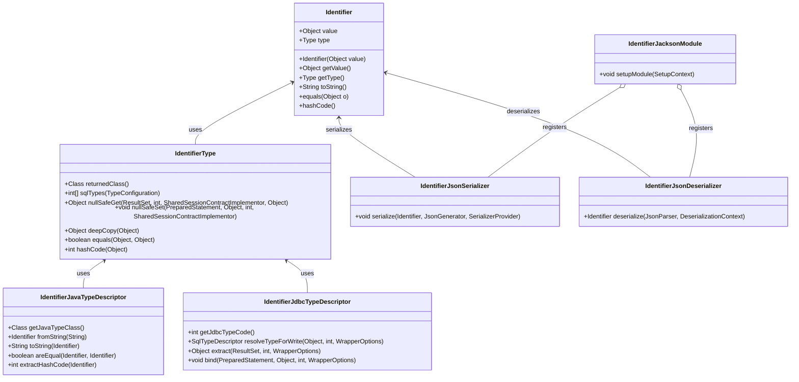
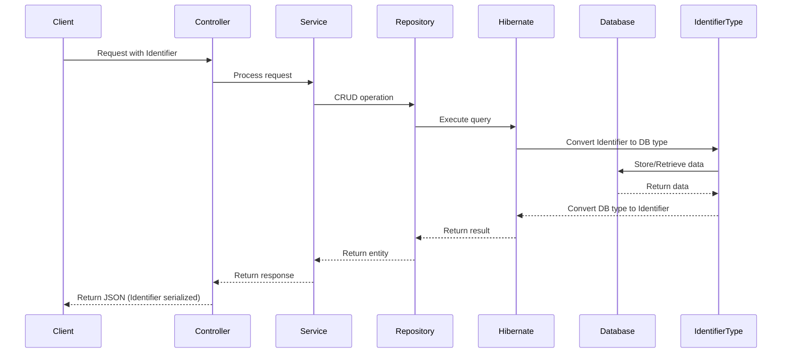

# Architecture for Hibernate Custom ID Type Demo

Status: Approved

## Technical Summary

This architecture defines the implementation of a custom Hibernate ID type called "Identifier" that can adapt between different underlying types (Long or String) at runtime. The implementation leverages Hibernate's type system and Spring Boot's auto-configuration capabilities to provide a seamless integration with Spring Data JPA repositories and different database dialects.

## Technology Table

| Technology | Version | Description |
| ------------ | ------- | ------------------------------------------------------------- |
| Java | 17 | Base programming language |
| Spring Boot | 3.2.x | Application framework |
| Hibernate | 6.4.x | ORM framework |
| Spring Data JPA | 3.2.x | Data access abstraction |
| Jackson | 2.15.x | JSON serialization/deserialization |
| H2 Database | 2.2.x | In-memory database for testing |
| MySQL | 8.0.x | Production database option |
| PostgreSQL | 15.x | Production database option |
| JUnit 5 | 5.10.x | Testing framework |
| Lombok | 1.18.x | Boilerplate code reduction |
| Maven | 3.9.x | Build tool |

## Architectural Diagrams

### Custom Type System Architecture



### Application Flow



## Data Models

### Core Identifier Class

```java
public class Identifier implements Serializable {
    private final Object value;
    private final Type type;
    
    public enum Type {
        LONG, STRING
    }
    
    // Static factory methods
    public static Identifier of(Long value) {
        return new Identifier(value, Type.LONG);
    }
    
    public static Identifier of(String value) {
        return new Identifier(value, Type.STRING);
    }
    
    // Private constructor
    private Identifier(Object value, Type type) {
        this.value = value;
        this.type = type;
    }
    
    // Getters
    public Object getValue() {
        return value;
    }
    
    public Type getType() {
        return type;
    }
    
    // Utility methods
    public String asString() {
        return value.toString();
    }
    
    public Long asLong() {
        if (type == Type.LONG) {
            return (Long) value;
        }
        return Long.parseLong((String) value);
    }
    
    // Object methods
    @Override
    public String toString() {
        return value.toString();
    }
    
    @Override
    public boolean equals(Object obj) {
        if (this == obj) return true;
        if (obj == null || getClass() != obj.getClass()) return false;
        Identifier that = (Identifier) obj;
        return Objects.equals(value, that.value);
    }
    
    @Override
    public int hashCode() {
        return Objects.hash(value);
    }
}
```

### Entity Example

```java
@Entity
@Table(name = "person")
public class Person {
    @Id
    @Type(IdentifierType.class)
    private Identifier id;
    
    private String name;
    
    // Getters, setters, etc.
}
```

### Repository Example

```java
public interface PersonRepository extends JpaRepository<Person, Identifier> {
    // Custom query methods
}
```

## Project Structure

```text
src/
├── main/
│   ├── java/
│   │   └── com/example/idtypedemo/
│   │       ├── config/
│   │       │   ├── DatabaseConfig.java              # Database configuration
│   │       │   └── JacksonConfig.java               # JSON serialization config
│   │       ├── controller/
│   │       │   └── PersonController.java            # REST endpoints
│   │       ├── domain/
│   │       │   ├── Identifier.java                  # Core ID type class
│   │       │   └── entities/
│   │       │       └── Person.java                  # Example entity
│   │       ├── repository/
│   │       │   └── PersonRepository.java            # Spring Data repository
│   │       ├── service/
│   │       │   └── PersonService.java               # Business logic
│   │       ├── type/
│   │       │   ├── IdentifierType.java              # Hibernate type implementation
│   │       │   ├── IdentifierJavaTypeDescriptor.java # Java type descriptor
│   │       │   └── IdentifierJdbcTypeDescriptor.java # JDBC type descriptor
│   │       ├── jackson/
│   │       │   ├── IdentifierJsonSerializer.java    # JSON serializer
│   │       │   ├── IdentifierJsonDeserializer.java  # JSON deserializer 
│   │       │   └── IdentifierJacksonModule.java     # Jackson module
│   │       └── IdTypeDemoApplication.java           # Spring Boot application
│   └── resources/
│       ├── application.properties                   # Common properties
│       ├── application-h2.properties                # H2 config
│       ├── application-mysql.properties             # MySQL config
│       └── application-postgresql.properties        # PostgreSQL config
└── test/
    └── java/
        └── com/example/idtypedemo/
            ├── domain/
            │   └── IdentifierTest.java              # Unit tests for Identifier
            ├── repository/
            │   └── PersonRepositoryTest.java        # Repository tests
            ├── service/
            │   └── PersonServiceTest.java           # Service tests
            └── type/
                └── IdentifierTypeTest.java          # Type system tests
```

## Infrastructure

For this demo project, we will use:
- H2 in-memory database for unit and integration testing
- MySQL and PostgreSQL for demonstrating dialect-specific handling
- Docker Compose for running MySQL and PostgreSQL instances locally

## Change Log

| Change | Story ID | Description |
| ------ | -------- | ----------- |
| Initial draft | N/A | Initial architecture document | 