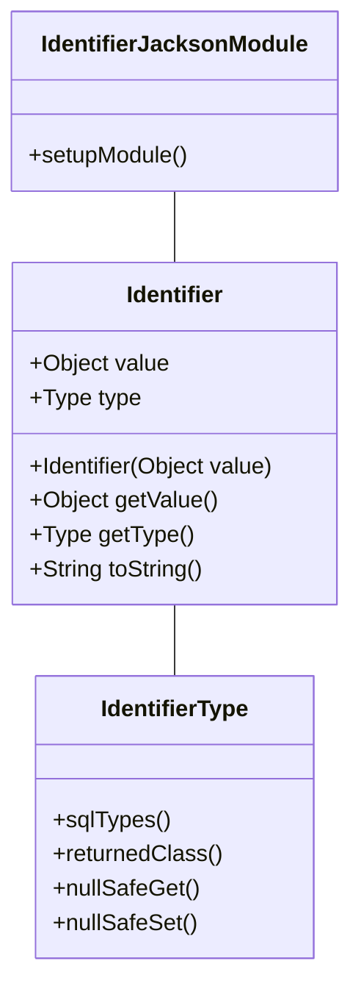

# 1. Title: PRD for Hibernate Custom ID Type Demo

<version>1.0.0</version>

## Status: Approved

## Intro

This project demonstrates how to implement a custom ID type called "Identifier" in Hibernate with Spring Boot 3. The Identifier type will adapt between different underlying types (Long or String) at runtime, with proper serialization/deserialization for different database systems and JSON conversion.

## Goals

- Create a custom ID type called "Identifier" that can internally be a Long or String based on runtime conditions
- Implement Hibernate's type system to handle proper serialization/deserialization
- Demonstrate the implementation works with MySQL, PostgreSQL, and H2 databases
- Ensure proper JSON serialization and string representation for the custom ID type
- Provide comprehensive tests to verify the implementation

## Features and Requirements

- Functional requirements
  - Define a custom `Identifier` class that can hold either Long or String values
  - Implement custom Hibernate type definition for the `Identifier` class
  - Create entity classes that use the `Identifier` type for ID fields
  - Demonstrate CRUD operations with entities using the custom ID type
  - Show how the ID type works with different database dialects (MySQL, PostgreSQL, H2)
- Non-functional requirements
  - Implement proper `toString()`, `equals()`, and `hashCode()` methods for the `Identifier` class
  - Ensure proper JSON serialization/deserialization using Jackson
  - Implement seamless integration with Spring Data JPA repositories
  - Provide comprehensive documentation on how to use the custom ID type

## Epic List

### Epic-1: Custom Identifier Type Implementation

### Epic-2: Database Integration Testing

### Epic-3: Future Enhancements (Beyond Scope of current PRD)

## Epic 1: Story List

- Story 1: Project Setup
  Status: ''
  Requirements:
  - Set up Spring Boot 3 project with Hibernate/JPA dependencies
  - Configure database connections for H2, MySQL, and PostgreSQL
  - Create basic entity structure for testing

- Story 2: Custom Identifier Type Implementation
  Status: ''
  Requirements:
  - Create the `Identifier` class with support for Long and String values
  - Implement proper `toString()`, `equals()`, and `hashCode()` methods
  - Add JSON serialization/deserialization support

- Story 3: Hibernate Type Integration
  Status: ''
  Requirements:
  - Implement necessary Hibernate UserType interfaces
  - Create type converters for different database systems
  - Configure Hibernate to use the custom type

- Story 4: Repository and Service Implementation
  Status: ''
  Requirements:
  - Create repository interfaces using the custom ID type
  - Implement service layer for CRUD operations
  - Test basic operations with the custom ID type

## Technology Stack

| Technology | Description |
| ------------ | ------------------------------------------------------------- |
| Spring Boot 3 | Application framework |
| Hibernate 6.x | ORM framework |
| Spring Data JPA | Data access abstraction |
| Jackson | JSON serialization/deserialization |
| H2 Database | In-memory database for testing |
| MySQL | Production database option |
| PostgreSQL | Production database option |
| JUnit 5 | Testing framework |
| Lombok | Boilerplate code reduction |

## Reference

### Type System Architecture



## Data Models, API Specs, Schemas, etc...

### Identifier Class

```java
public class Identifier implements Serializable {
    private final Object value;
    private final Type type;
    
    public enum Type {
        LONG, STRING
    }
    
    // Constructors, getters, etc.
}
```

### Entity Example

```java
@Entity
public class Person {
    @Id
    @Type(IdentifierType.class)
    private Identifier id;
    
    private String name;
    
    // Getters, setters, etc.
}
```

## Project Structure

```text
src/
├── main/
│   ├── java/
│   │   └── com/example/idtypedemo/
│   │       ├── config/
│   │       │   └── JacksonConfig.java
│   │       ├── domain/
│   │       │   ├── Identifier.java
│   │       │   └── entities/
│   │       │       └── Person.java
│   │       ├── repository/
│   │       │   └── PersonRepository.java
│   │       ├── service/
│   │       │   └── PersonService.java
│   │       ├── type/
│   │       │   └── IdentifierType.java
│   │       └── IdTypeDemoApplication.java
│   └── resources/
│       ├── application.properties
│       ├── application-h2.properties
│       ├── application-mysql.properties
│       └── application-postgresql.properties
└── test/
    └── java/
        └── com/example/idtypedemo/
            ├── domain/
            │   └── IdentifierTest.java
            ├── repository/
            │   └── PersonRepositoryTest.java
            └── service/
                └── PersonServiceTest.java
```

## Change Log

| Change         | Story ID | Description             |
| -------------- | -------- | ----------------------- |
| Initial draft  | N/A      | Initial draft PRD       | 