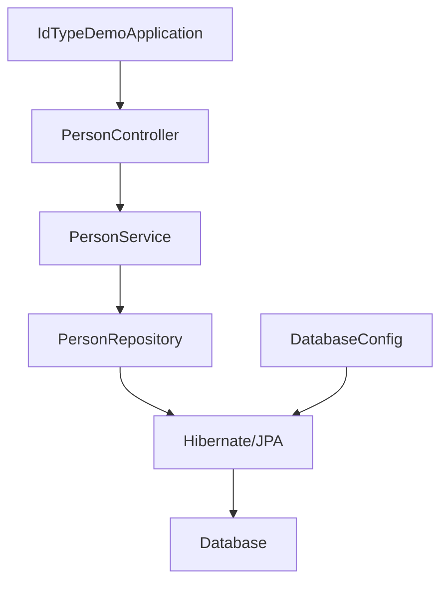

# Epic-1 - Story-1

Project Setup for Hibernate Custom ID Type Demo

**As a** developer
**I want** to set up a Spring Boot 3 project with Hibernate/JPA
**so that** I can implement and test a custom ID type called "Identifier"

## Status

Complete

## Context

This is the first story in Epic-1 (Custom Identifier Type Implementation). We need to set up a Spring Boot project with Hibernate/JPA support, configure database connections for H2, MySQL, and PostgreSQL, and create a basic entity structure for testing the custom ID type.

## Estimation

Story Points: 1

## Tasks

1. - [x] Set up Spring Boot 3 project with dependencies
   1. - [x] Create Maven project with Spring Boot 3 and Spring Data JPA
   2. - [x] Add necessary dependencies (Hibernate, Jackson, etc.)
   3. - [x] Set up project structure
2. - [x] Configure database connections
   1. - [x] Set up H2 database configuration for testing
   2. - [x] Create MySQL configuration
   3. - [x] Create PostgreSQL configuration
   4. - [x] Create a Docker Compose file for local database instances
3. - [x] Create basic entity structure
   1. - [x] Create a simple Person entity
   2. - [x] Create a repository interface
   3. - [x] Set up basic service layer

## Constraints

- Must use Spring Boot 3.2.x or later
- Must use Hibernate 6.4.x or later
- Must use Java 17 or later

## Data Models / Schema

### Basic Entity Schema

```java
@Entity
@Table(name = "person")
public class Person {
    @Id
    private Long id; // This will be replaced with Identifier in the next story
    
    private String name;
    
    // Getters, setters, etc.
}
```

### Repository Interface

```java
public interface PersonRepository extends JpaRepository<Person, Long> {
    // Custom query methods
}
```

## Structure

The project will follow the standard Spring Boot structure:

```text
src/
├── main/
│   ├── java/
│   │   └── com/example/idtypedemo/
│   │       ├── config/
│   │       │   └── DatabaseConfig.java
│   │       ├── domain/
│   │       │   └── entities/
│   │       │       └── Person.java
│   │       ├── repository/
│   │       │   └── PersonRepository.java
│   │       ├── service/
│   │       │   └── PersonService.java
│   │       └── IdTypeDemoApplication.java
│   └── resources/
│       ├── application.properties
│       ├── application-h2.properties
│       ├── application-mysql.properties
│       └── application-postgresql.properties
└── test/
    └── java/
        └── com/example/idtypedemo/
            ├── repository/
            │   └── PersonRepositoryTest.java
            └── service/
                └── PersonServiceTest.java
```

## Diagrams

### Project Component Structure



## Dev Notes

- We will start with a simple implementation using standard Long IDs before replacing them with our custom Identifier type
- We will use H2 for initial testing to avoid external database dependencies
- The Docker Compose file will help developers run MySQL and PostgreSQL locally for further testing

## Chat Command Log

- User: 我需要验证hibernate结合springboot3的场景下，验证ID的类型变成个自定义的类型，名称就叫Identifier，这个实际的类型由运行时决定，比如说Long或String。
- AI: I'll help set up a project to test custom ID types in Hibernate with Spring Boot 3
- AI: Created project structure, Spring Boot application, entity, repository, service, and controller classes
- AI: Set up database configurations for H2, MySQL, and PostgreSQL
- AI: Created Docker Compose for running MySQL and PostgreSQL locally
- AI: Added unit test for repository and created README.md 