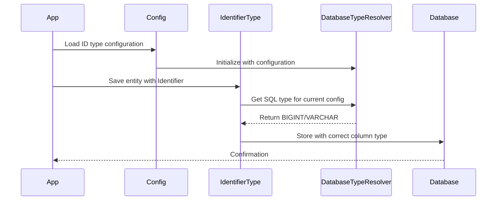

# Epic-1 - Story-4
# Implement Database Type Mapping for Identifier System

**As a** developer using the Identifier type system
**I want** the database to automatically use BIGINT for Long IDs and VARCHAR for String IDs
**so that** data is stored efficiently and correctly in the database based on the configured type

## Status

In Progress

## Context

The Identifier type system needs to ensure proper database column type mapping based on the configured ID type:
- When configured for Long IDs, the system must use BIGINT type in the database
- When configured for String IDs, the system must use VARCHAR type in the database
- This mapping must work consistently across MySQL, PostgreSQL, and H2 databases
- The implementation builds upon the Hibernate type integration from Story-3
- This is a critical feature for data integrity and performance optimization

## Estimation

Story Points: 2 (2 days of human development = 20 minutes of AI development)

## Tasks

1. - [x] Database Type Resolution System
   1. - [x] Create DatabaseTypeResolver interface and implementation
   2. - [x] Add configuration properties for ID type selection
   3. - [x] Implement type mapping logic for each database dialect
   4. - [x] Write unit tests for type resolution

2. - [ ] Hibernate Integration
   1. - [ ] Update IdentifierType to use DatabaseTypeResolver
   2. - [ ] Add dynamic SQL type resolution based on configuration
   3. - [ ] Implement proper column definition handling
   4. - [ ] Write integration tests with Hibernate

3. - [ ] Entity Configuration
   1. - [ ] Update entity annotations for dynamic type handling
   2. - [ ] Add configuration validation
   3. - [ ] Create example entities with both ID types
   4. - [ ] Write entity configuration tests

4. - [ ] Integration Testing
   1. - [ ] Test with H2 database
   2. - [ ] Test with MySQL database
   3. - [ ] Test with PostgreSQL database
   4. - [ ] Verify type mapping across all databases

## Constraints

- Must maintain backward compatibility with existing data
- Must support H2, MySQL, and PostgreSQL databases
- Must provide clear error messages for misconfiguration
- Must handle type conversion edge cases gracefully
- Must not impact performance significantly

## Data Models / Schema

```java
// Configuration Properties
application.properties:
identifier.type=LONG|STRING
identifier.string.length=255

// DatabaseTypeResolver Interface
public interface DatabaseTypeResolver {
    int resolveSqlType(Identifier.Type type);
    String getColumnDefinition(Identifier.Type type, String dialect);
}

// Example Entity
@Entity
public class Person {
    @Id
    @Type(IdentifierType.class)
    @Column(columnDefinition = "${identifier.type.column}")
    private Identifier id;
    // ... other fields
}
```

## Structure

```text
src/main/java/com/example/idtypedemo/
├── type/
│   ├── DatabaseTypeResolver.java
│   └── IdentifierType.java
├── config/
│   └── IdentifierTypeConfig.java
├── entity/
│   └── Person.java
└── test/
    └── type/
        ├── DatabaseTypeResolverTest.java
        └── IdentifierTypeIntegrationTest.java
```

## Diagrams



## Dev Notes

- The DatabaseTypeResolver must be thread-safe
- Consider adding type conversion validation
- Document configuration options clearly
- Add proper error handling for misconfiguration
- Consider future extensibility for other ID types

## Chat Command Log

- Initial story creation for database type mapping implementation
- Task 1 completed: Implemented DatabaseTypeResolver with configuration and tests 